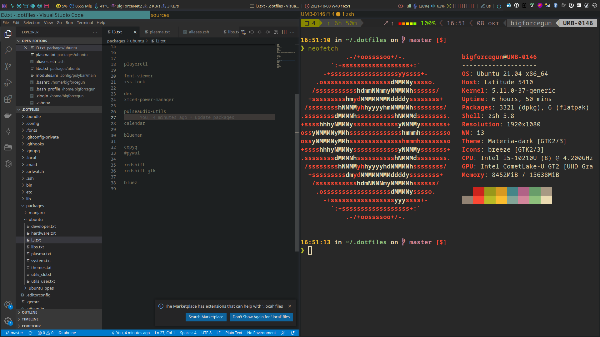

# ~/.dotfiles

🏠 Simple personal dotfiles repo



## Usage

```bash
git clone https://github.com/bigforcegun/dotfiles.git ~/.dotfiles
~/.dotfiles/setup_system
~/.dotfiles/setup_user
# pkgs
~/.dotfiles/setup_packages_ubuntu
```

## Sources of inspiration

- http://dotfiles.github.io/
- https://github.com/gpakosz/.tmux
- https://github.com/maximbaz/dotfiles
- https://coderoncode.com/tools/2017/04/16/vim-the-perfect-ide.html
- https://github.com/weilbith/dotfiles
- https://github.com/WillPower3309/dotfiles
- https://github.com/addy-dclxvi/i3-starterpack
- https://github.com/Mofiqul/i3-gaps-gruvbox-material

## Sources to research

- https://github.com/Artem-Schander/dotfiles/blob/master/tmux/tmux.conf.local.symlink
- https://github.com/nicknisi/dotfiles

## Notes and snippets

### Skip git hooks

```bash
git -c hooks.gitleaks=false commit -m 'Test hook2'
```

### Systemd mount unit name

```bash
systemd-escape -p --suffix=mount "/home/bigforcegun/mounts/station"
```


### Fix manjaro python update fail


```sh
sudo pacman -S python-jeepney --overwrite '*'
```